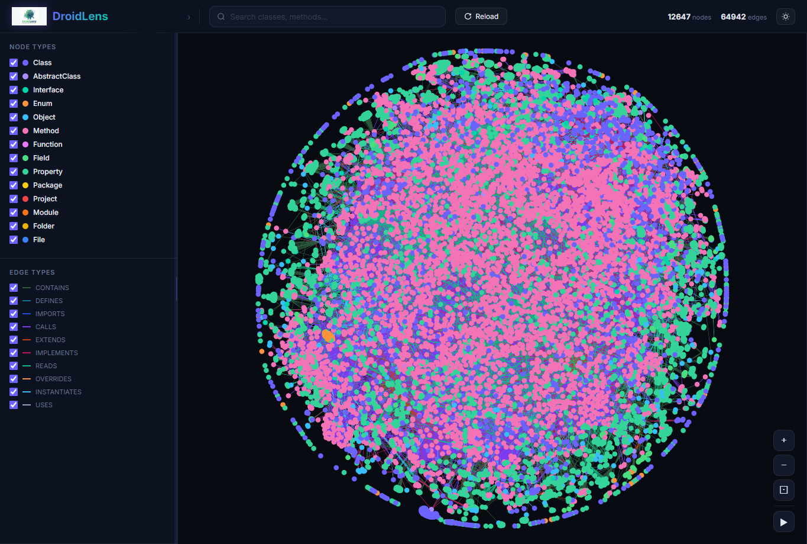
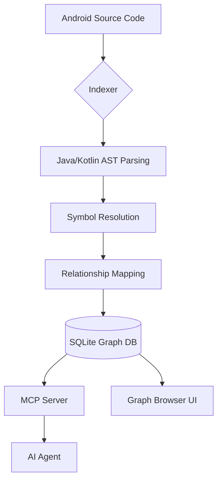

# DroidLens

<div align="center">

  

  <h2>Visual code intelligence for Android codebases.</h2>

  <a href="https://www.python.org/">
    
  </a>
  <a href="https://kotlinlang.org/">
    
  </a>
  <a href="https://modelcontextprotocol.io/">
    
  </a>
  <a href="LICENSE">
    
  </a>

  <p><strong>Building the nervous system for Android AI agents.</strong></p>

</div>

DroidLens indexes your entire Android codebase — every class, method, field, dependency, and call chain — into a high-performance knowledge graph. It then exposes this intelligence through smart tools so AI agents (Cursor, Claude Code, etc.) stop missing context, breaking call chains, and shipping blind edits.

> *Like a magnifying glass for your Android architecture.* DroidLens helps you *visualize* and *analyze* your code through a relational lens that tracks every connection, not just text.

**TL;DR:** The **Graph Browser** is a visual way to explore any Android repo. The **CLI + MCP** is how you make your AI agent actually reliable — it gives your coding assistant a deep architectural view of your Kotlin/Java code so it stays aware of inheritance, interface implementations, and blast radius.



---

## Two Ways to Use DroidLens

|                   | **CLI + MCP (Recommended)**                                            | **Graph Browser (Web UI)**                                             |
| ----------------- | -------------------------------------------------------------- | ------------------------------------------------------------ |
| **What**    | Index repos locally, connect AI agents via MCP                 | Visual graph explorer + code navigation in browser           |
| **For**     | Daily development with Cursor, Claude Code, Windsurf           | Quick exploration, architectural audits, visual tracing      |
| **Scale**   | Full repos, any size                                           | Visual-focused, handles thousands of nodes via WebGL         |
| **Install** | `pip install -e .`                                    | Included in CLI (`droidlens serve`)                          |
| **Storage** | SQLite + Global Registry (Persistent)                          | Served via FastAPI backend                                   |
| **Parsing** | AST-based indexing (Java/Kotlin)                               | Dynamic data fetching from graph                             |
| **Privacy** | Everything local, no network                                   | Everything local, no server outside your machine             |

---

## Quick Start

### 1. Installation

**Prerequisites:**
- **Python 3.10+** installed on your system.

```bash
# Clone the repository
git clone https://github.com/quangbk198/DroidLens.git
cd DroidLens

# Install in editable mode
pip install -e .
```

### 2. Index your Android project

Run this from your Android project root (or provide the path):

```bash
python -m droidlens index .
```

> [!TIP]
> After running `pip install -e .`, you can also use the shorter `droidlens` command directly if your Python Scripts folder is in your system `PATH`.

This command parses your code, builds the SQLite graph, registers the project in the global registry (`~/.droidlens/registry.json`), and scaffolds agent-specific files (`AGENTS.md`).

### 3. Explore Visually

```bash
python -m droidlens serve
```

Launches the interactive **Graph Browser** at `http://localhost:7070`.

---

## AI Agent Integration (MCP)

DroidLens runs a standard **Model Context Protocol (MCP)** server. This allows it to integrate with any AI editor or agent that supports the MCP standard.

### Supported Tools & Editors

DroidLens works out-of-the-box with:
- **Cursor**
- **Claude Code**
- **Antigravity**
- **Windsurf**
- **Claude Desktop**
- **Codex**
- **Any other MCP-compatible client**

### Universal Configuration

Most editors can be configured by adding DroidLens to your `mcp.json` or equivalent configuration file:

```json
{
  "mcpServers": {
    "droidlens": {
      "command": "python",
      "args": ["-m", "droidlens", "mcp"]
    }
  }
}
```

**Claude Code**:

```bash
claude mcp add droidlens -- python -m droidlens mcp
```

---

## CLI Commands Reference

| Command | Description |
|---|---|
| `python -m droidlens index [path]` | Index an Android project (or update stale index) |
| `python -m droidlens serve [path]` | Launch the interactive graph browser UI |
| `python -m droidlens mcp` | Start MCP stdio server (serves all indexed repos) |
| `python -m droidlens stats [path]` | Print graph statistics (nodes, edges, types) |
| `python -m droidlens list` | List all indexed projects in the global registry |
| `python -m droidlens clean [path]` | Delete index for a specific project |
| `python -m droidlens clean --all` | Delete all indexes and clear the registry |

---

## What Your AI Agent Gets

**14 tools** exposed via MCP for deep codebase analysis:

| Tool | Description |
|---|---|
| `get_stats` | Check index freshness and node/edge counts |
| `search_nodes` | Find classes, methods, fields by name (fuzzy/type-aware) |
| `get_class_info` | Detailed view of a class (members, hierarchy, interfaces) |
| `get_node` | Inspect a single node (file path, line numbers, docs) |
| `get_neighbors` | Immediate callers, callees, and relationships |
| `get_call_chain` | Trace a full execution flow between two points |
| `impact` | Blast radius analysis (what breaks if I change this?) |
| `find_usages` | All references/calls of a method or class |
| `get_dependencies` | Class-level dependency analysis |
| `list_classes` | Catalog all classes in a package or project |
| `index_project` | Re-index a project on-demand via the agent |
| `sql_query` | Run custom SQLite queries against the knowledge graph |
| `list_projects` | Discover all indexed repositories |
| `switch_project` | Dynamically switch context between projects |

---

## How It Works

DroidLens uses a multi-phase indexing pipeline to build a structural map of your Android app:



1.  **Parsing**: Extracts every class, method, interface, and field using language-specific AST visitors.
2.  **Resolution**: Maps interface implementations, class inheritance, and method calls across the entire project.
3.  **Storage**: Builds a high-performance SQLite database stored locally in `.droidlens/graph.db`.
4.  **Global Registry**: Centralizes all indexed projects so your AI agent can switch repos without reconfiguration.

---

## The Problem DroidLens Solves

Tools like **Cursor** and **Claude** are powerful, but they struggle with large-scale Android architectures. They often:
1.  Edit a method without knowing it's an interface override with 10 implementations.
2.  Miss usages of a constant that is accessed via static imports.
3.  Fail to trace a dependency injection chain.

**DroidLens provides precomputed structural intelligence.** Instead of the LLM guessing relationships from raw text, it queries a verified graph that knows exactly how your code hangs together.

---

## Tech Stack

-   **Backend**: Python 3.10+, FastAPI, Uvicorn
-   **Database**: SQLite (local, file-based)
-   **Parsing**: AST-based visitors for Java and Kotlin
-   **Frontend**: Force-Graph (WebGL), Canvas, Vanilla JS
-   **Agent Protocol**: Model Context Protocol (MCP)

---

## Security & Privacy

-   **Local First**: Everything runs on your machine. No code is ever uploaded to a server.
-   **Transparent**: The graph database is a standard SQLite file you can inspect yourself.
-   **Open Source**: Audit the code and the indexing logic.

---

## Star History

[](https://star-history.com/#quangbk198/DroidLens&Date)

---

## Acknowledgments

-   [Tree-sitter](https://tree-sitter.github.io/) (for parsing inspirations)
-   [Force-Graph](https://github.com/vasturiano/force-graph) (for the high-performance visualization)
-   [MCP](https://modelcontextprotocol.io/) (for the agent communication standard)
